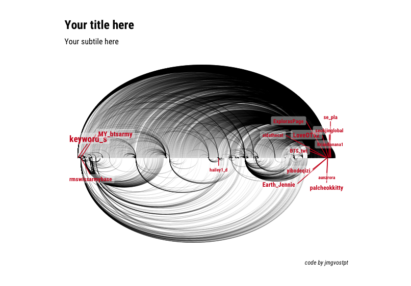

# twitter_viz
A RStudio script for twitter keywords visualization

# What you will need 

## Libraries 
rtweet
igraph
hrbrthemes
ggraph
tidyverse

## For rtweet
You will need an active twitter account 
When rtweet runs the first time it will open a browser window asking you permission to use your twitter account

## What it does 
This RStudio script query's the twitter API for the last 4000 tweets that include the keyword you choose 
It then generates a linear (circular or not) with the relationships observed

## Example 

